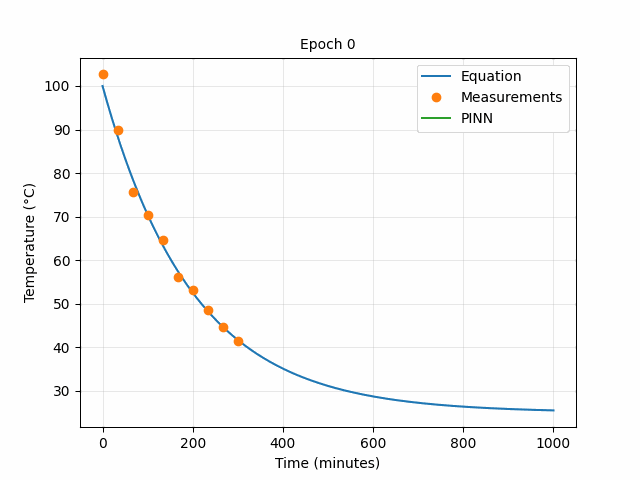

# PINN - coffee example

A simple implementation of a Physics-Informed Neural Network (PINN) to predict the temperature of a cooling cup of coffee, based on [[1](#references)].

## Premise

We consider a cooling coffee cup and try to predict the temperature of the coffee after 10-15 mins. We make 10 measurements in the first 5 mins and we don't want to wait any longer, so we train a neural network (NN) to predict the temperature for us.

We assume the coffee cools following a simple Newton's cooling law:

$$
  \frac{dT(t)}{dt} = r(T_{env}-T(t))
$$

where $T(t)$ is the temperature of the coffee, $T_{env}$ is the temperature of the environment, $r$ is the cooling rate and $t$ is time.

## Physics-Informed Neural Network (PINN)

We include the PDE, the equation presented above, in the loss function of the NN. This works as a regularizer for the network and helps it follow the physics where data is missing as visualized below.

  

## References

[1] [Physics-informed Neural Networks: a simple tutorial with PyTorch](https://medium.com/@theo.wolf/physics-informed-neural-networks-a-simple-tutorial-with-pytorch-f28a890b874a)
